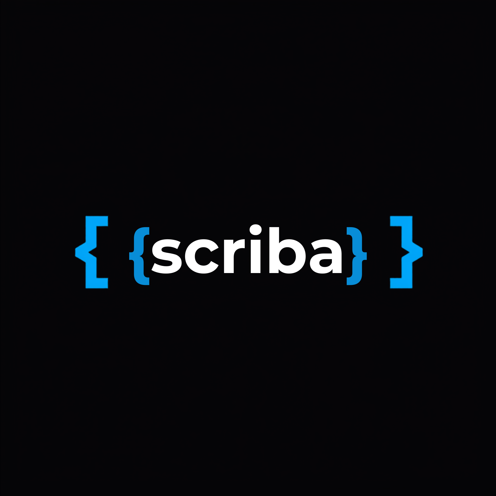

<p align="center">
  
</p>

# Scriba

A lightweight, event‑driven scripting DSL with a reflection‑based runtime and hierarchical property paths (e.g., `player.stats.health`).

**Status:** *Work in Progress (pre‑alpha)*  
Scriba is under active development. Syntax, APIs, and behavior may change as the language evolves.

---

## Features

- **Lexer / Parser**  
  Tokenizes and parses Scriba source into an AST.

- **AST Definitions**  
  Structured nodes for expressions, statements, and event blocks.

- **Evaluator Skeleton**  
  Expression evaluation and statement execution (in progress).

- **Reflection System**  
  Allows host applications to expose native objects, properties, and methods.

- **Property / Method Registry**  
  Supports hierarchical property paths and native method binding.

- **Automation Tests**  
  Growing suite of unit tests for scanner, parser, evaluator, and runtime behavior.

---

## Roadmap (High‑Level)

- [x] Scanner  
- [x] Parser  
- [x] AST  
- [x] Expression evaluator  
- [ ] Statement execution  
- [ ] Control flow (`if`, `while`, `return`)  
- [ ] Error reporting improvements  
- [ ] Standard library  
- [ ] Embedding examples  
- [ ] Documentation  

---

## Example (Early Syntax)

```scriba
event onStart():
    print("Hello from Scriba!")

event onDamage(amount):
    if amount > 10:
        print("That hurt!")
```
